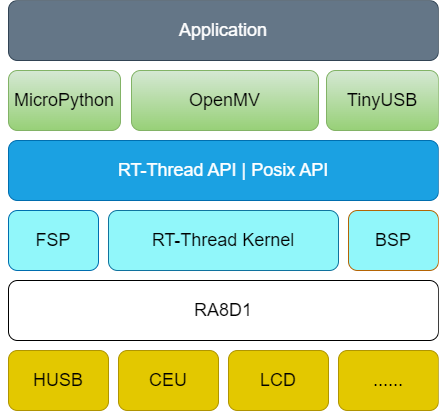
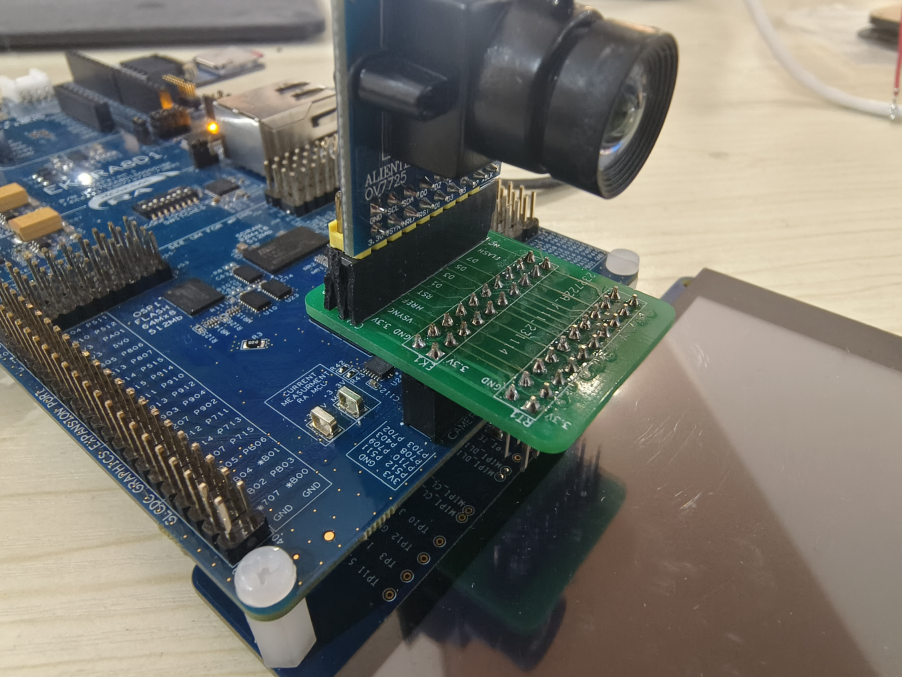
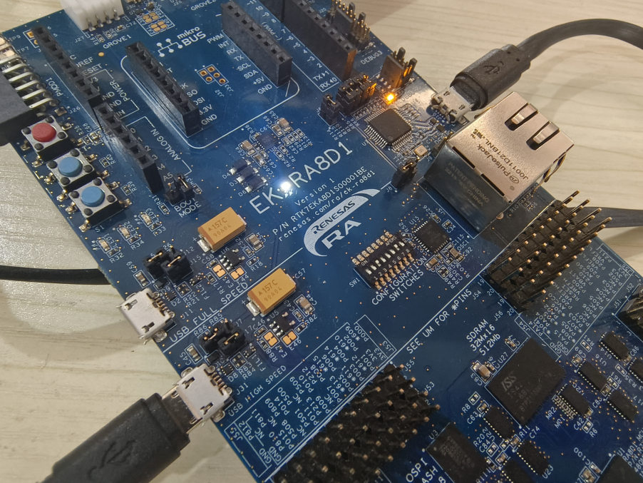
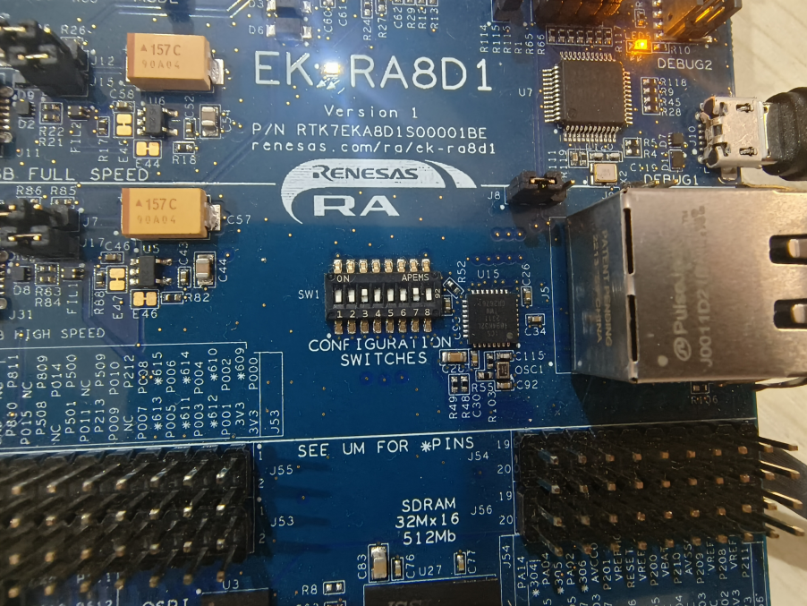
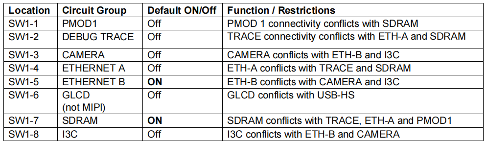
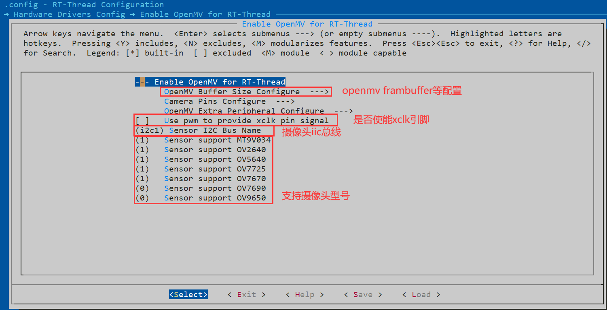
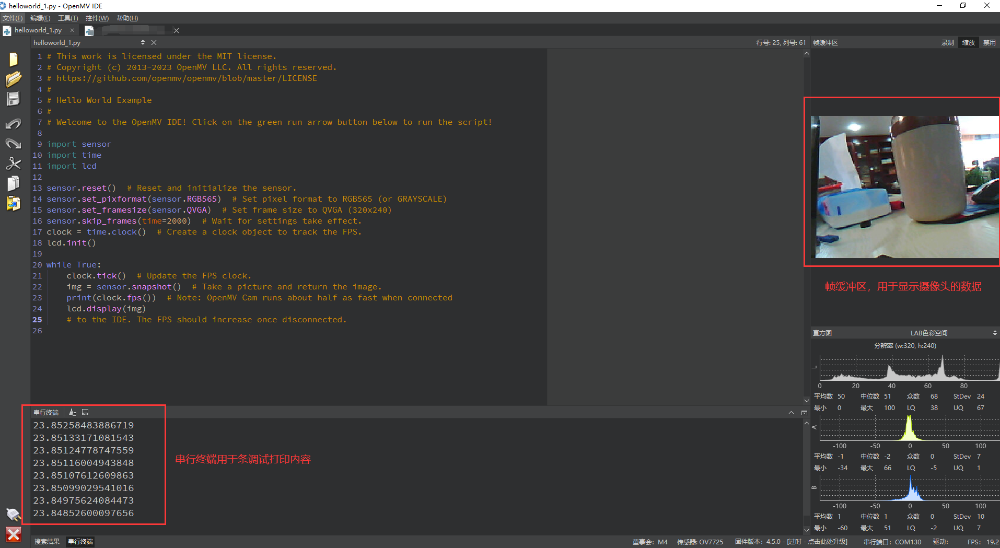
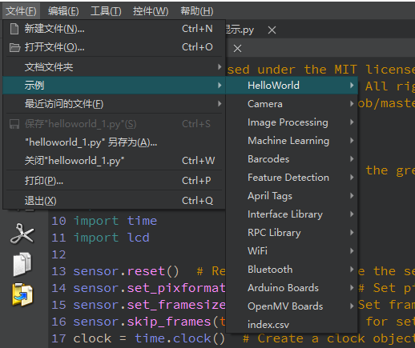

# OpenMV&RA8 参考设计说明 

## 简介

本参考设计为嵌入式AI 爱好者以及高校提供了一套快速简洁的模型验证方法：基于 **Micropython** 环境使用 python 语言开发并验证机器视觉等算法。

本文档为 RA8&OpenMV 参考设计说明。目前已经初步完成基于 **RT-Thread5.1.0** 对 **OpenMV4.5.0** 版本的移植和适配，接下来将介绍如何快速将OpenMV 固件编译并烧录到 **EK-RA8D1** 开发板上。

## 简介

使用国内最主流的实时操作系统：**RT-Thread**。RT-Thread 与其他很多 RTOS 如 FreeRTOS、uC/OS 的主要区别之一是，它不仅仅是一个实时内核，还具备丰富的中间层组件。它具体包括以下部分:

* 内核层：RT-Thread 内核;
* 组件与服务层;
* RT-Thread 软件包;
* 设备驱动框架;
* ......

组件与服务层：组件是基于 RT-Thread 内核之上的上层软件，例如虚拟文件系统、FinSH 命令行界面、网络框架、设备框架等。采用模块化设计，做到组件内部高内聚，组件之间低耦合。

RT-Thread 软件包：运行于 RT-Thread 物联网操作系统平台上，面向不同应用领域的通用软件组件，由描述信息、源代码或库文件组成。RT-Thread 提供了开放的软件包平台，这里存放了官方提供或开发者提供的软件包，该平台为开发者提供了众多可重用软件包的选择，这也是 RT-Thread 生态的重要组成部分。

---

OpenMV 是由美国克里斯团队基于 MicroPython 发起的开源机器视觉项目，目的是创建低成本，可扩展，使用 python 驱动的机器视觉模块。OpenMV 搭载了 MicroPython 解释器，使其可以在嵌入式端进行 python 开发，基于 OpenMV 可以进行多种机器视觉应用的实现，比如人脸检测，物体分类等。目前 OpenMV 也被广泛的应用于国内外高校的竞赛中。

## 系统框架



## 硬件连接说明

硬件清单：

* EK-RA8D1
* OV7725（推荐）/OV2640/OV7670
* 摄像头转接板
* mipi屏幕（选配）
* USB电缆x2

以下是开发板的连接示意图：

**摄像头部分示意图**：



**USB部分示意图**：



**拨码开关部分示意图**：需要将拨码开关拨置 00100010



**拨码开关选通功能如下示意图**：



## 软件使用说明

### 软件环境

* MDK＞= 5.38版本
* RT-Thread [ENV](https://download_redirect.rt-thread.org/download/env_release/env_released_1.3.5.7z) 配置工具
* Renesas [FSP5.1.0](https://github.com/renesas/fsp/releases/download/v5.1.0/setup_fsp_v5_1_0_rasc_v2023-10.exe)版本

支持 ENV 配置 OpenMV 基本信息，包括：frambuffer、摄像头引脚、摄像头型号等。



### 编译

双击 **project.uvprojx** 文件打开MDK工程


点击下图按钮进行项目全编译：


### 烧录

点击下图按钮进行固件烧录：


### Todo

- [ ] TFlite-Micro 支持
- [ ] Machine 模块支持
- [ ] 文件相关支持

## OpenMV 使用说明

到目前为止，EK-RA8D1 已经成为了可以运行 OpenMV 的开发板，接下来介绍下如何使用它连接 OpenMV IDE 运行我们第一个Hello World 程序。

### 环境准备

请自行安装 OpenMV IDE：

* [OpenMV IDE-4.0.14版本](https://github.com/openmv/openmv-ide/releases/download/v4.0.14/openmv-ide-windows-4.0.14.exe) 

### 运行Hello World 程序

1、点击左下角的连接设备按钮，等待连接成功


2、点击连接下面的运行按钮，即可运行编码区域的 Micropython 代码，下图是一些常用的功能区域说明：



3、OpenMV IDE 还有很多示例，大家可以自行体验：



**注：更多的示例以及教程可以详见 [OpenMV 文档中心](https://book.openmv.cc/)**

---

### OpenMV Uart 示例

说明：使用的是EK-RA8D1的Uart3外设，其对应引脚为：RX-P408|TX-P409，使用如下代码进行测试。

```python
import time
from pyb import UART

# Always pass UART 3 for the UART number for your OpenMV Cam.
# The second argument is the UART baud rate. For a more advanced UART control
# example see the BLE-Shield driver.
uart = UART(3, 19200)

while True:
    uart.write("Hello World!\r")
    time.sleep_ms(1000)
```

可以使用USB-TTL模块查看控制台（波特率：19200）打印的内容

### OpenMV IIC 示例

说明：I2C第一个参数为I2C的总线，这里请填写1（即IIC1总线）

```python
from pyb import I2C

i2c = I2C(1, I2C.MASTER)
i2c.scan()
```

运行后，终端会显示：i2c scan addr:[20 33]，这里的 address 需要根据实际开发板外挂的从机 address 决定。

